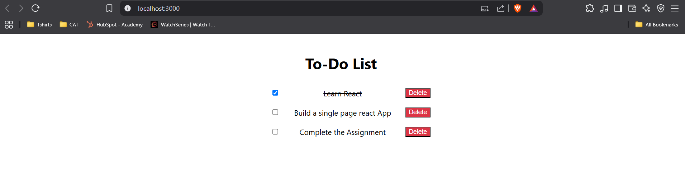

# This is the assignment first assignment that you should work on

This project is a simple To-Do list application. Where you have three entries hard coded in a List. Later this List is used to map the corresponding key value pair which is checkListText, the text that we are providing as a check list and the checkListStatus to check whether it is completed or not.

Let's dive into the logic

All the logic is written in todoList.js, which is located at src/components/todoList.js. We are exporting this as a component to render in App.js

Let's see each code snippet

Here is a List that I've hard coded to get the text and the status of the checkList items

### const tasks = [
###    { checkListText: "Learn React", checkListStatus: true },
###    { checkListText: "Build a single page react App", checkListStatus: false },
###    { checkListText: "Complete the Assignment", checkListStatus: false },
###  ];

Next I've created a unorded list to map each item from the hardcoded list (tasks) to a ListItem (<li>)

### <ul>
###        {tasks.map((task, index) => (
###          <li key={index} className={task.checkListStatus ? "checkListStatus" : ""}>
###            <input type="checkbox" checked={task.checkListStatus} readOnly />
###            {task.checkListText}
###            <button>Delete</button>
###          </li>
###        ))}
### </ul>

Next let's look at App.js

Here we are importing the component todoList.js and using it to return

### import TodoList from "../src/components/todoList.js";
### function App() {
###  return (
###    

###      <TodoList />
###    

###  );
### }

You style your code as you which and that logic is in todoList.css

## Assignment-one

Create a react app for todo list of all your assigments.

Guidelines:

1) create a list with 2 key value pairs, one for your todo list text and one for the status to determine whether it's completed or not. And you can hard code any values of your choice :)
2) create an unordered list and map the hardcoded list to a list element
3) export this component
4) import the component that you've created in App.js
5) style your component in a separate class and import that to your component class
6) now your first react app is live :P

UI reference:

### Some sueful things to know before starting

In the project directory, you can run:

npm start
Runs the app in the development mode.
Open http://localhost:3000 to view it in your browser.

The page will reload when you make changes.
You may also see any lint errors in the console.

npm test
Launches the test runner in the interactive watch mode.
See the section about running tests for more information.

npm run build
Builds the app for production to the build folder.
It correctly bundles React in production mode and optimizes the build for the best performance.

The build is minified and the filenames include the hashes.
Your app is ready to be deployed!

See the section about deployment for more information.

npm run eject
Note: this is a one-way operation. Once you eject, you can't go back!

If you aren't satisfied with the build tool and configuration choices, you can eject at any time. This command will remove the single build dependency from your project.

Instead, it will copy all the configuration files and the transitive dependencies (webpack, Babel, ESLint, etc) right into your project so you have full control over them. All of the commands except eject will still work, but they will point to the copied scripts so you can tweak them. At this point you're on your own.

You don't have to ever use eject. The curated feature set is suitable for small and middle deployments, and you shouldn't feel obligated to use this feature. However we understand that this tool wouldn't be useful if you couldn't customize it when you are ready for it.